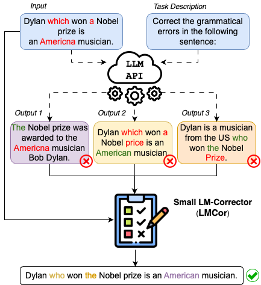

# LM-Corrrector

> [**Small Language Models Improve Giants by Rewriting Their Outputs**](https://arxiv.org/abs/2305.13514v1)  
> Giorgos Vernikos, Arthur Bražinskas, Jakub Adamek, Jonathan Mallinson, Aliaksei Severyn, Eric Malmi  
> European Chapter of the Association for Computational Linguistics (EACL) 2024

---
## Overview
In this work we present a novel method to enhance the performance of Language Model Models (LLMs) **using only their outputs**. We employ a small model, the LM-Corrector (LMCor) to *rank*, *combine* and *edit* diverse candidate outputs generated by LLMs, resulting in superior-quality outputs compared to in-context learning and reranking approaches.

<p align="center">
  
</p>


This repository contains code for training a T5 (or similar) model as an LM-Corrector or for standard fine-tuning for text generation tasks. These tasks include grammatical error correction, data-to-text generation, summarization, and machine translation.

## Installation

This project requires `Python 3.10`, `PyTorch 1.12.1`, and transformers `4.34.0`.

It's advisable to set up a separate environment for this project and install the necessary dependencies:

```
conda create -n lmcor python=3.10
conda activate lmcor
pip install -r requirements.txt
```

## Datasets
LMCor is evaluated on various tasks and datasets:

* **Grammatical Error Correction**: CoNLL-14
* **Data-to-Text Generation**: E2E NLG (cleaned)
* **Summarization**: XSum
* **Machine Translation**: WMT22 En->De

The code integrates `E2E` and `XSum` datasets via the [Datasets](https://github.com/huggingface/datasets) library. For `WMT22 En->De`, you need to manually download the validation and test sets from [sacreBLEU](https://github.com/mjpost/sacrebleu) and store them in the `data/wmt22/en-de/` folder with filenames `validation.<x>` and `test.<x>`, where `<x>` = en, de. For training, 200k sentences are sampled from News Commentary v16, available [here](https://www.statmt.org/wmt22/translation-task.html).

## Training LMCor

### LLM-generated candidates

To train an LM-Corrector, you first need predictions for the training and validation sets from a Language Model (LLM). Assume these files are stored in the corresponding `data/<task>/` folder as `train_[llm_name]` and `validation_[llm_name]`. In this project, we used the greedy decoded output along with 4 sampled outputs from the LLM. You can edit the filenames in the `train_t5.py` script using the `FILE_SAMPLE` and `FILE_GREEDY` global variables.

To train the corrector execute the `train_t5.py` script:

```
python train_t5.py --task xsum --corrector --bsize 8 --grad_acc_steps 16 --output_dir lmcor_xsum
```
> Note: to train a standard t5 model remove the `--corrector` flag

** MODELS DIR**

## Evaluate LMCor

To obtain predictions from the corrector, use the `eval_t5.py` script:

```
python eval_t5.py --task xsum --ckpt lmcor_xsum --split test --bsize 32 
```
The outputs of LMCor will be saved in the model folder in the file `model_preds.txt`.

Finally, to compute scores for various metrics, run the `compute_textgen_metrics.py` script:

```
python compute_textgen_metrics --task xsum --hyp lmcor_xsum/model_preds.txt
```

---
## Reference
Please feel free to cite our paper if you use our code or proposed algorithm.:
```
@misc{vernikos2023small,
      title={Small Language Models Improve Giants by Rewriting Their Outputs}, 
      author={Giorgos Vernikos and Arthur Bražinskas and Jakub Adamek and Jonathan Mallinson and Aliaksei Severyn and Eric Malmi},
      year={2023},
      eprint={2305.13514},
      archivePrefix={arXiv},
      primaryClass={cs.CL}
}
```

---
## Contact
Please feel free to raise an issue or contact me in case you require any help setting up the repo!
